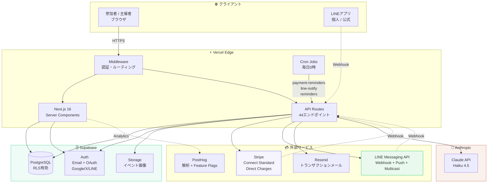
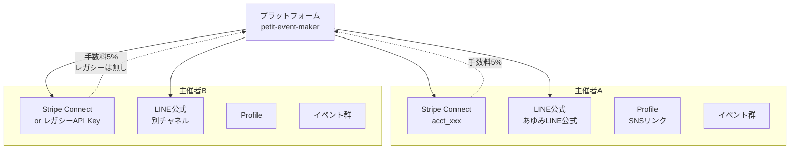

# システムアーキテクチャ

**バージョン**: 1.0
**最終更新**: 2026-05-09

---

## 全体構成



---

## レイヤード構成（Next.js App Router）

```mermaid
flowchart LR
    subgraph Pages["📄 Pages (Server Components)"]
        P1[/ ランディング/]
        P2[/explore<br/>カレンダー＋リスト]
        P3[/events/[id]<br/>イベント詳細]
        P4[/[username]<br/>主催者ポートフォリオ]
        P5[/dashboard<br/>主催者管理]
        P6[/dashboard/insights/[id]<br/>ファネル＋AI分布]
        P7[/my/history<br/>AIスキルマップ]
    end

    subgraph APIs["⚙️ API Routes"]
        A1[events<br/>CRUD]
        A2[bookings<br/>予約・キャンセル]
        A3[stripe<br/>checkout/webhook<br/>connect/start・callback]
        A4[line<br/>webhook/messages<br/>followers/tags]
        A5[analytics<br/>view/insights]
        A6[syllabus-suggest<br/>+ syllabus-ai]
        A7[follow / categories<br/>tags / my/history]
        A8[cron<br/>payment-reminders<br/>line-notify<br/>reminders]
    end

    subgraph Lib["📚 lib/"]
        L1[supabase/<br/>server/admin/client]
        L2[stripe.ts<br/>stripe-connect.ts]
        L3[line.ts<br/>push/multicast/broadcast]
        L4[analytics.ts<br/>user-history.ts]
        L5[claude.ts<br/>syllabus-ai.ts]
        L6[follows.ts<br/>check-event-access.ts]
        L7[email.ts<br/>email-templates.ts]
    end

    Pages --> APIs
    Pages --> Lib
    APIs --> Lib
```

---

## デプロイトポロジ

```mermaid
flowchart LR
    Dev[ローカル<br/>localhost:3007] -->|git push| GH[GitHub<br/>main branch]
    GH -.手動.-> VC[Vercel<br/>本番]
    VC --> CDN[Vercel Edge CDN<br/>petit-event-maker-am.vercel.app]
    CDN --> Users((世界中のユーザー))

    VC -->|Cron 0時| Crons[/api/cron/*]
    VC -.環境変数.-> ENV[STRIPE_SECRET_KEY<br/>STRIPE_CONNECT_CLIENT_ID<br/>ANTHROPIC_API_KEY<br/>RESEND_API_KEY<br/>NEXT_PUBLIC_SUPABASE_URL<br/>SUPABASE_SERVICE_ROLE_KEY<br/>CRON_SECRET]

    style VC fill:#000,color:#fff
```

---

## セキュリティ境界

```mermaid
flowchart TB
    subgraph Public["🌐 公開アクセス"]
        Anon[匿名ユーザー]
        AnonAPI[公開API<br/>events一覧・詳細<br/>/api/categories<br/>/api/tags]
    end

    subgraph Authed["🔐 認証必須"]
        User[ログインユーザー]
        UserAPI[認証必須API<br/>booking/follow<br/>my/* settings/*]
    end

    subgraph Admin["👑 管理者専用"]
        Owner[Creator]
        Coadmin[共同管理者]
        Super[Super Admin<br/>imatoru@gmail.com]
        AdminAPI[canManageEvent<br/>events/[id]/PUT/DELETE<br/>bookings操作<br/>attendance/export<br/>syllabus-ai/insights]
    end

    subgraph Service["🔧 service_role"]
        Webhook[Webhooks]
        Cron2[Crons]
        AdminClient[admin client<br/>RLSバイパス]
    end

    Anon --> AnonAPI
    User --> UserAPI
    Owner --> AdminAPI
    Coadmin --> AdminAPI
    Super --> AdminAPI

    Webhook -.SUPABASE_SERVICE_ROLE_KEY.-> AdminClient
    Cron2 -.CRON_SECRET.-> AdminClient

    AnonAPI --> RLS[(RLS Enforced)]
    UserAPI --> RLS
    AdminAPI --> AdminClient
    AdminClient --> DB2[(PostgreSQL)]
    RLS --> DB2

    style Service fill:#FFF1F0,stroke:#dd0000
    style Admin fill:#FFF9F5,stroke:#C26A4A
```

---

## マルチテナント構造

各主催者が自身の Stripe / LINE / メール送信元を持つ独立テナント構造：



---

## 主要技術スタック

| レイヤー | 技術 | 採用理由 |
|---|---|---|
| フロントエンド | Next.js 16 (Turbopack) | RSC + 高速ビルド |
| UI | shadcn/ui + Tailwind v4 | デザインシステム整合 |
| 認証 | Supabase Auth | OAuth拡張容易 |
| DB | PostgreSQL via Supabase | RLS でテナント分離 |
| ストレージ | Supabase Storage | Auth と連携 |
| 決済 | Stripe Connect (Standard) | 手数料モデル |
| 通知 | LINE Messaging API + Resend | 主催者に近い体験 |
| AI | Claude Haiku 4.5 | コスト効率 |
| 解析 | PostHog | Feature Flag併用 |
| デプロイ | Vercel | Edge CDN + Cron |

---

## アンチパターン記録

設計上避けた選択：

- ❌ **専用モバイルアプリ** — PWAで代替（コスト圧縮）
- ❌ **Express Connect** — Standardで主催者に自由度を与えた
- ❌ **マルチクラウド** — Vercel + Supabase + Stripe で完結
- ❌ **GraphQL** — REST + RPC で十分、複雑性を避けた
- ❌ **Redis キャッシュ** — Next.js revalidate と Stripe側キャッシュで十分

---

*Architecture Diagram v1.0 — 2026-05-09*
