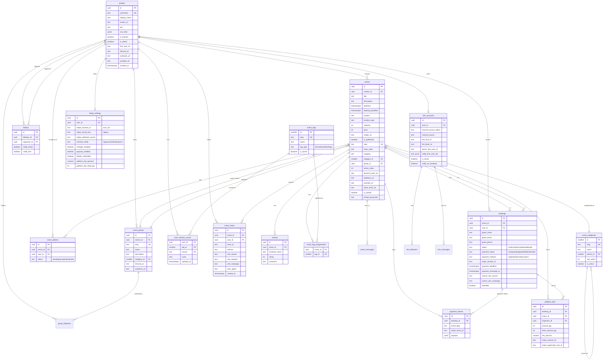
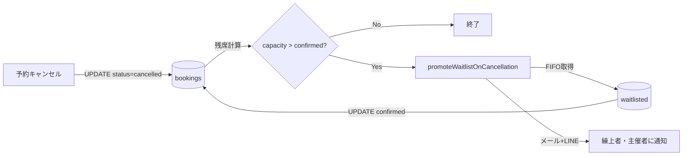
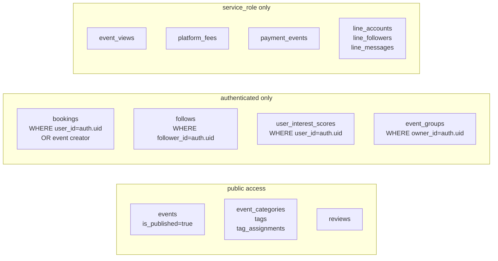

# データフロー図 / ER図

**バージョン**: 1.0
**最終更新**: 2026-05-09

---

## ER 図（エンティティ関係）



---

## 主要データフロー

### A. 予約 → 決済 → 集計

```mermaid
flowchart LR
    User((参加者)) -->|フォーム入力| BookingForm[BookingForm]
    BookingForm -->|POST| BookAPI[/api/events/[id]/book]
    BookAPI -->|INSERT| Bookings[(bookings)]
    BookAPI -->|有料| CheckoutAPI[/api/stripe/checkout]
    CheckoutAPI -->|Direct Charge| Stripe[Stripe Connect]
    Stripe -->|webhook| StripeHook[/api/stripe/webhook]
    StripeHook -->|UPDATE paid| Bookings
    StripeHook -->|INSERT| PayEvents[(payment_events)]
    StripeHook -->|INSERT| Fees[(platform_fees)]

    Bookings -.集計.-> Insights[/dashboard/insights/[id]]
    Fees -.手数料収入.-> Insights
```

### B. 閲覧トラッキング → ファネル分析

```mermaid
flowchart LR
    Visitor((訪問者)) -->|ページ表示| EventPage[/events/[id]]
    EventPage -->|client tracker| ViewAPI[/api/events/[id]/view]
    ViewAPI -->|INSERT| Views[(event_views)]
    Views -.集計.-> Insights[インサイトダッシュボード]
    Bookings[(bookings)] -.集計.-> Insights
    Insights -->|ファネル| Funnel[閲覧UU → 予約 → 決済]
    Insights -->|UTM| Source[流入元別]
    Insights -->|参加者分析| Audience[他カテゴリ嗜好<br/>AIレベル分布]
```

### C. AIシラバス推薦パイプライン

```mermaid
flowchart LR
    Audience[(参加者プロファイル<br/>他参加カテゴリ<br/>AIレベル分布)] -->|集計| AudienceInsights[getAudienceInsights]
    Past[(主催者の過去開催)] -->|抽出| OwnCats[ownCategoryNames]
    AudienceInsights --> Builder[buildAudienceInputForEvent]
    OwnCats --> Builder
    Builder -->|AudienceInput| Claude[Claude Haiku 4.5<br/>messages.parse + Zod schema]
    Claude -->|3 suggestions| UI[SyllabusSuggester]
    UI -->|タイトル/根拠/レベル/形式/時間| Organizer((主催者))
    Organizer -->|採用| NewEvent[/events/new<br/>?title=...]
```

### D. LINE通知マルチキャスト

```mermaid
flowchart LR
    Booking[新規予約] --> BookAPI[/api/events/[id]/book]
    BookAPI -->|notify_line_user_ids 取得| DB[(line_accounts)]
    DB -->|配列| Recipients[管理者A<br/>管理者B<br/>管理者C]
    BookAPI -->|配列が複数なら| Multicast[multicastLineMessage]
    BookAPI -->|1人なら| Push[pushLineMessage]
    Multicast --> Recipients
    Push --> Recipients
```

### E. キャンセル待ち繰り上げ



---

## RLS ポリシーマップ



---

## マイグレーション履歴（採番のみ抜粋）

| Migration | 主な変更 |
|---|---|
| `20260320000000_init` | 初期スキーマ |
| `20260328100000_line_accounts` | LINE連携 |
| `20260401100000_create_menus` | 定期メニュー |
| `20260406200000_add_waitlisted_status` | キャンセル待ち |
| `20260420000000_add_stripe_settings` | Stripe（レガシー方式） |
| `20260505000000_add_payment_events` | 決済監査ログ |
| `20260508000000_add_taxonomy` | AI領域カテゴリ・タグ |
| `20260508100000_add_follows` | 主催者フォロー |
| `20260509000000_add_analytics` | 閲覧トラッキング・UTM |
| `20260509100000_add_external_integrations` | Discord/Substack/YouTube |
| `20260509200000_add_groups` | Group/Series機能 |
| `20260509300000_add_multi_admin_notify` | 複数管理者通知 |
| `20260509400000_stripe_connect` | Stripe Connect + 手数料 |

---

*Data Flow / ER Diagram v1.0 — 2026-05-09*
