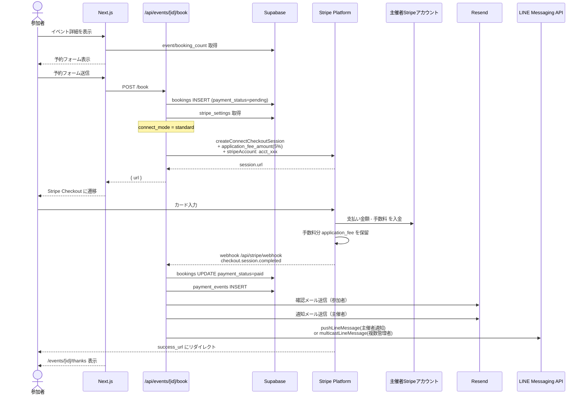
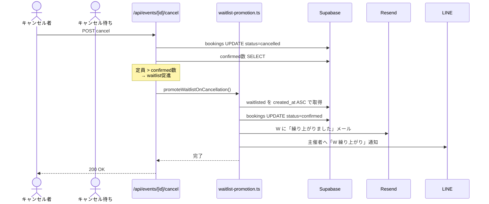
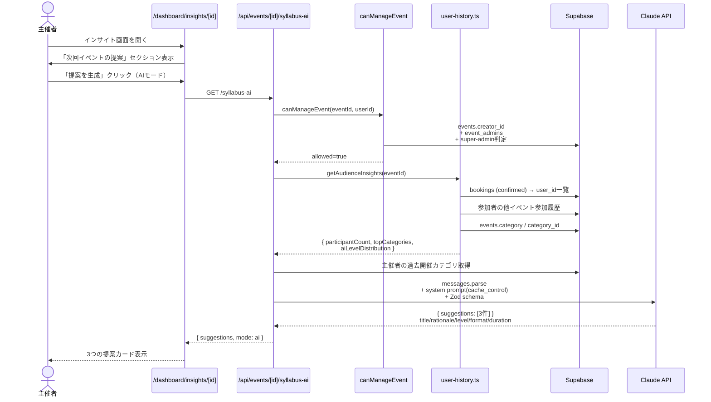
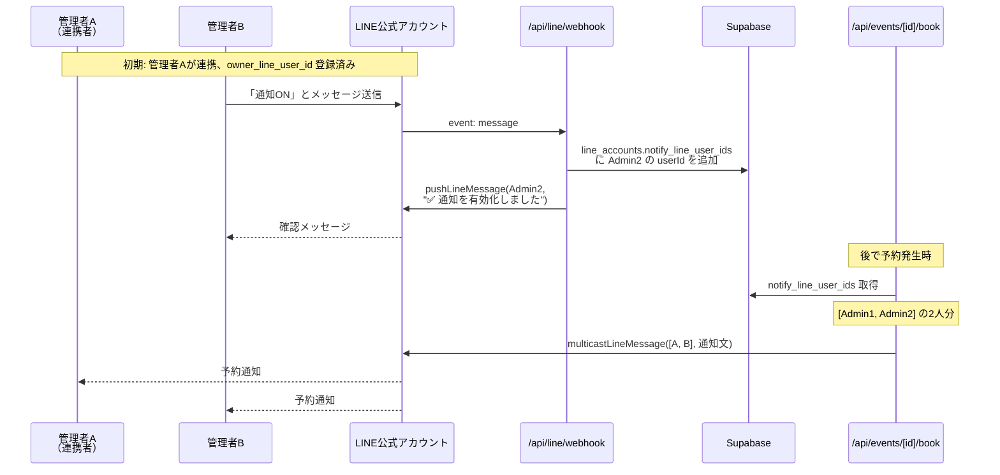
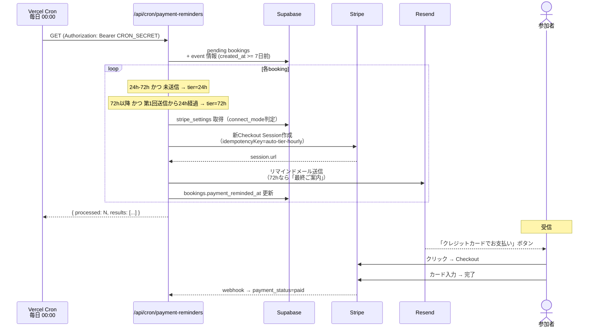
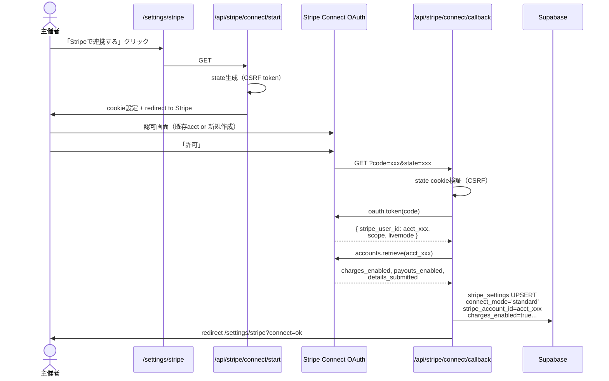
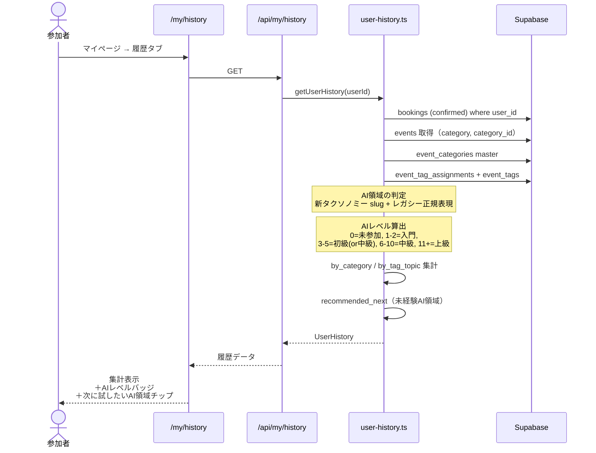
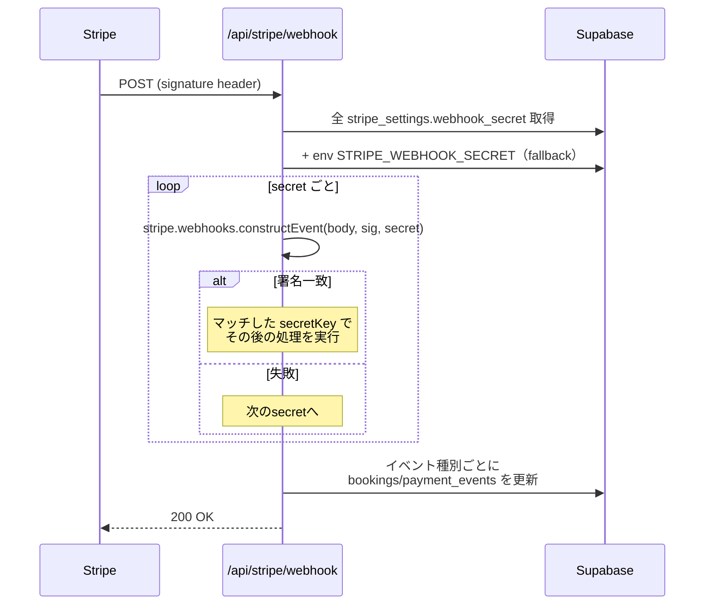

# 主要フロー シーケンス図

**バージョン**: 1.0
**最終更新**: 2026-05-09

---

## 1. 有料イベント予約 → 決済（Stripe Connect）

---

## 2. キャンセル待ち自動繰り上げ

---

## 3. AI生成シラバス推薦（Claude Haiku 4.5）

---

## 4. LINE複数管理者通知（multicast）

---

## 5. 未払い予約への自動リマインダー（cron）

---

## 6. Stripe Connect OAuth 連携

---

## 7. 興味プロファイル算出 + AIスキルレベル判定

---

## 8. Webhook認可（Stripe webhook 多店舗対応）

---

*Sequence Diagrams v1.0 — 2026-05-09*
